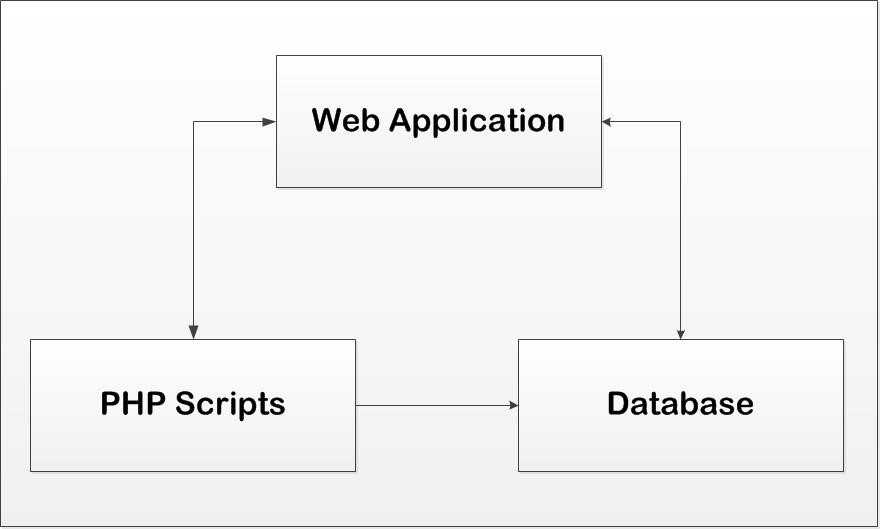
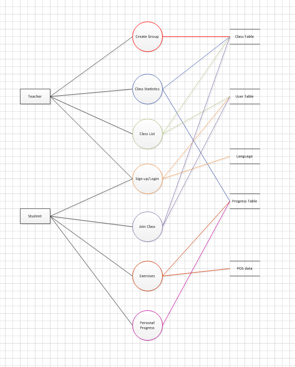
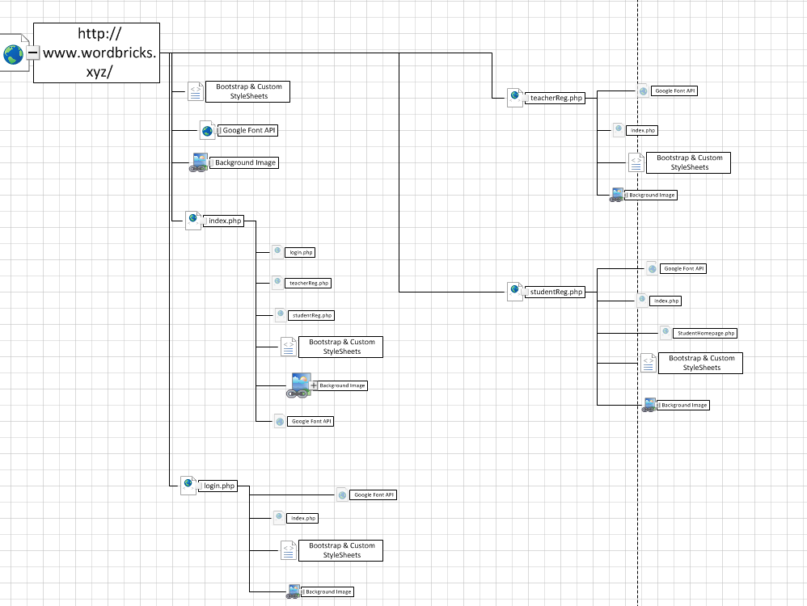
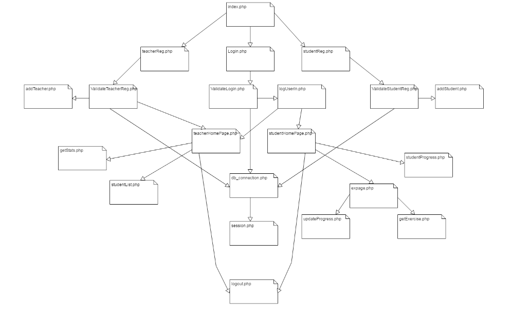
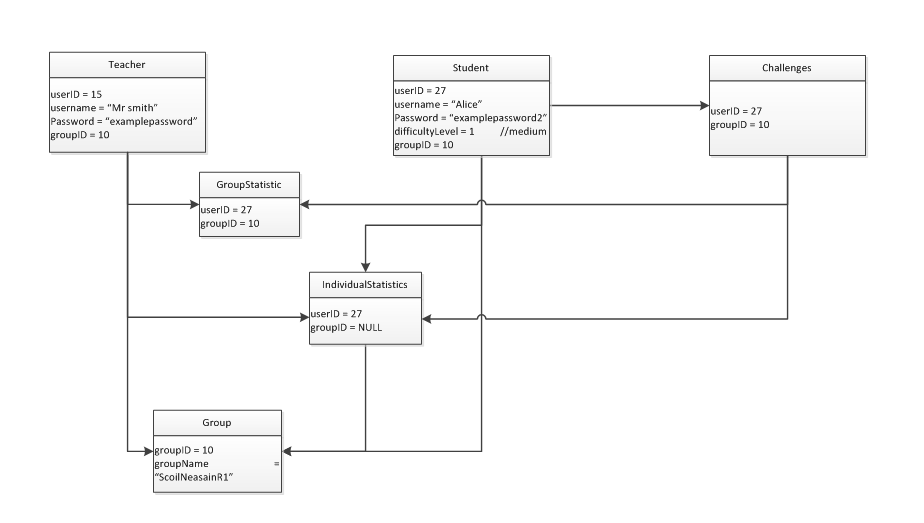
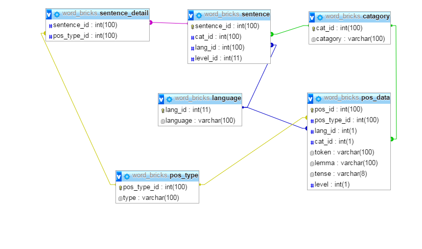
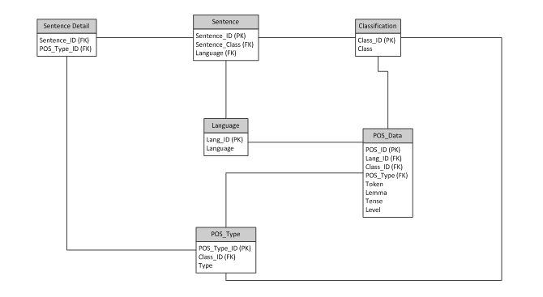

**1. Introduction**
===================

1.1 Overview

The system is an interactive web application aimed at primary schools. This
application is for children to learn a new language by constructing sentences in
a fun and interactive way. Teachers can also sign up and monitor their classes
progress.

The project is based on the concept of sentence construction. A student with
basic vocabulary and some knowledge of grammar rules may want to practice them
by experimenting with the forming of simple sentences. At this stage, it is
important to make sure that the sentences are built properly, and if not, the
student gets appropriate feedback, encouraging them to keep trying. By creating
sentences, the student can learn through a “trial and error” method of dragging
words together to construct a sentence.

Example (Irish): ‘Tá – mé – sásta’ is a correct Irish sentences, whereas ‘Mé –
tá – sásta’ is incorrect.

The student can then also take this understanding and construct ‘Tá – Seán -
tinn’, building up their vocabulary. This system will teach children how to
correctly form sentences and let them progress through the different levels.
Teachers also have the opportunity to create an account and monitor their pupils
progress.

The basic idea behind the project is the construction of a valid sentence from a
given selection of words (blocks). One inspiration behind the idea is how we
were taught Irish through school, from old textbooks memorising everything. A
lot of students who are finished school would describe their experience of
learning Irish as boring and we want to increase the appeal of Irish for
students. Another inspiration behind the project is the Scratch programming
language learning environment, in this the blocks are shaped like jigsaw-puzzle
pieces so it is intuitive to join them together, unfortunately natural language
is more complex and therefore more difficult to implement.

Irish sentences for example are formed in the following order ‘verb – subject –
object’, this is how we identified the Irish words to construct the sentences
when pulling from the database. As students’ progress through the various levels
the words become more difficult for the student to construct the sentence.

The words reside in one table with appropriate attributes to distinguish their
language, type and difficulty level. This allows system to pull the appropriate
words needed to construct a correct sentence every time the user attempts an
exercise.

From this logic we were able to build this system to be language independent and
extensible. By changing the logic of which words to pull from the database we
also constructed the system to create Scottish-Gaelic sentences. This leaves the
door open for the future possibilityof adding more languages to the database and
young children learning multiple languages with one system.

1.2 Glossary

*POS: Part of speech*

*Blockly: Framework developed by google to generate word blocks and join them
together.*

*Plotly.js: Add in for graph construction*

### **System Specification**

### **2.1 System Architecture Diagram**

>   SimpleSystemDiagram.jpg

The system architecture is designed with the components ‘Web application – PHP
scripts – Database’. The Web application is the front end which is what the user
sees, this connects to the database and PHP scripts query the database and pull
information from the database to the web application. PHP is located on the
server which communicates to the java-script which is on the server side.
Communication from the server to the java-script worked well, however for the
java-script to communicate back to the server we needed to put AJAX in place.

### **3. High-Level Design**

### Data Flow Diagram(DFD)

### Component Diagram

The above diagram depicts the first two levels of the website, excluding the
homepages and exercise page.

### Component Diagram

### Object Diagram

### Business Rules

**Sentence**: Chain of valid parts of speech joined together to express
information.

**Part of speech**: Single words that can be used to form a sentence.

**Category**: Divides sentiment expressed by sentences into groups.

**Token**: equal to part of speech.

**Type**: The family that a part of speech belongs to i.e. (Verb, Noun,
Adjective).

### Database

### Logical Diagram

### **4. Problems and Resolution**

Developing a web application was new territory for both of us and due to this we
met problem after problem throughout the design and development.

Our first major problem was when we were installing the LAMP stack on our
server. We followed tutorials from DigitalOcean.com but this led to problems as
some tutorials were out of date and used deprecated versions of the software. We
attempted this various times finally piecing tutorials together to get
everything working with up-to-date software.

Throughout the project we had to learn how to use PHP, Javascript, build a
database and get everything working smoothly together. These were new skills for
us which meant a lot of time and research had to go into them before beginning
to start development. We followed tutorials online if we ran into any problems
and learned as we went.

The first big problem we encountered was the incorporation of the blockly
framework, this was difficult to learn as we had no prior experience with
javascript. Learning how it behaved and twisting it slightly to fit our needs
took up a large chunk of the development time. The Blockly developer docs and
google forums helped us.

Our lack of experience led to another oversight in that we did not realise that
when the web page loads, the PHP has its work done as it executes on the server
before the client side javascript. This meant that we could easily pass the PHP
values to the javascript but it took a long time for us to realise we would need
to use Ajax to go in the opposite direction and give the PHP scripts data to
update the database.

In terms of testing, we had hoped to construct unit tests during development but
found it hard to identify potential test cases and when trying to configure
PHPUnit for running tests on the database it got very complex very quickly. The
original plan was to have very isolated and effective tests that did not rely on
any information in the database or any other functions except exactly what it
was testing, owing to the difficulty with PHPUnit we had to insert test values
into the database and then hard code expected values in the tests. This is less
than ideal but still provides some reassurance that the functions are working
properly.

Due to time constraints we had to focus more on making the app work well for the
Irish language, this means that to make the app genuinely language independent
we will have to tweak its operations and add more logic to handle the languages
characteristics. It currently works for Irish and Scottish Gaelic which has a
similar sentence format.

### **5. Installation Guide**

A normal user wanting to access the app, they can use it through a browser
without need for any special software.

In order to run the app on our server, we needed to have PHP and a set of
packages for communication with the mySQL MariaDB database we used and Apache
for the web server.

### **6. References**

**TWITTER BOOTSTRAP FRAMEWORK**

In-text: ("Bootstrap")

URL: https://getbootstrap.com/

Your Bibliography: "Bootstrap". getbootstrap.com. N.p., 2017.Web. Mar. 2017.

**PLOTLY**

In-text: ("Plotly")

URL: https://plot.ly/javascript/

Your Bibliography: "Plotly". *Plot.ly*. N.p., 2017.Web. Mar. 2017.

**DIGITALOCEAN: CLOUD COMPUTING DESIGNED FOR DEVELOPERS**

In-text: ("Digitalocean: Cloud Computing Designed For Developers")

URL: https://www.digitalocean.com/

Your Bibliography: "Digitalocean: Cloud Computing Designed For Developers".
*DigitalOcean*. N.p., 2017.Web. Mar. 2017.

**BLOCKLY \| GOOGLE DEVELOPERS**

In-text: ("Blockly \| Google Developers")

URL: https://developers.google.com/blockly/

Your Bibliography: "Blockly \| Google Developers". *Google Developers*. N.p.,
2017. Web. 10 Mar. 2017

**W3SCHOOLS ONLINE WEB TUTORIALS**

In-text: ("W3schools Online Web Tutorials")

URL: https://www.w3schools.com/

Your Bibliography: "W3schools Online Web Tutorials". *W3schools.com*. N.p.,
2017.Web. Mar. 2017.
